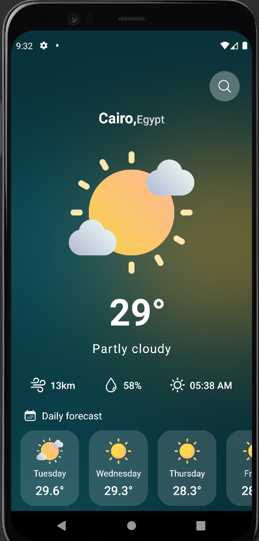

# Weather-App Task

# App Screenshots





## Features

- Cross-platform (Web, iOS, Android)


## Run Locally

Clone the project

```bash
  git clone https://github.com/mohy404/Home-Workout.git
```

Go to the project directory

```bash
  cd Home-Workout
```

Install dependencies

```bash
  npm install
```

Start the server

```bash
  npm start
```